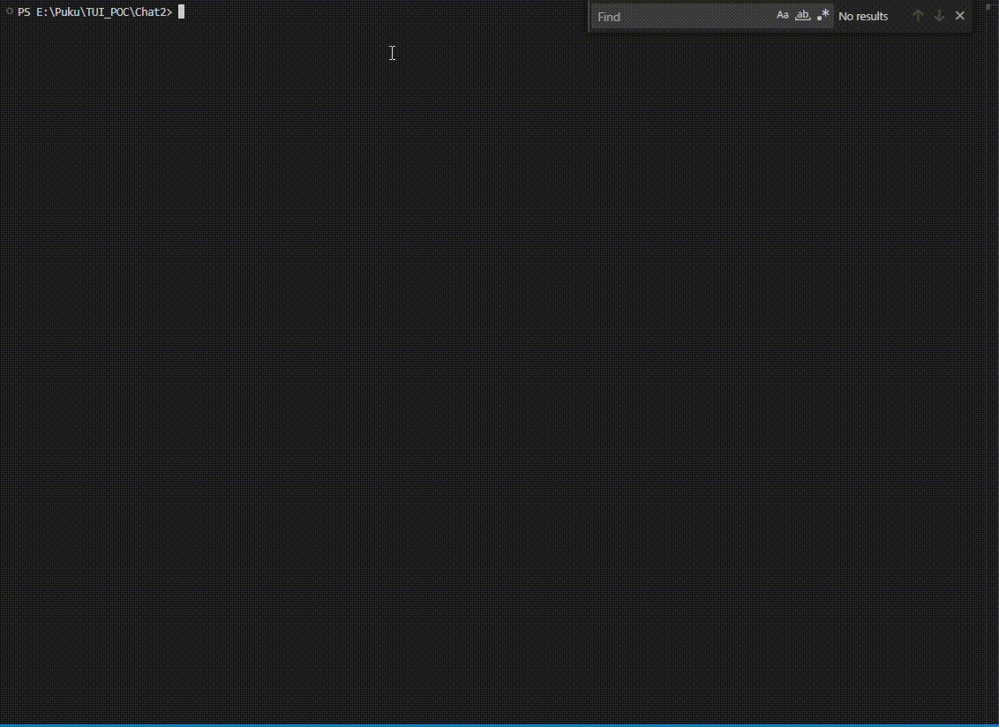

# PUKU CLI 🌟

A modern, aesthetic Terminal User Interface (TUI) CLI application for AI-powered conversations with multiple theme support and advanced features.


## Features

### **Multi-Theme Support**
- **PUKU Theme**: Purple gradient with dark background (#1a1b26)
- **Ocean Theme**: Blue oceanic colors with dark navy background  
- **Forest Theme**: Green nature-inspired palette with dark teal background
- **Live Theme Switching**: Change themes instantly with `/theme` command

### **Visual Design**
- **ASCII Art Title**: Large "PUKU CLI" with gradient effects
- **Rounded Borders**: Modern container styling with lipgloss
- **Responsive Layout**: Adapts to terminal window size
- **Color-Coded Messages**: Distinct styling for user/AI conversations
- **Status Indicators**: Real-time provider and streaming status

### **AI Integration**
- **Multiple Providers**: OpenRouter support with extensible architecture
- **Streaming Responses**: Real-time AI response rendering
- **Provider Switching**: Tab key to cycle between available providers
- **Environment Config**: Support for `.env` files and environment variables

### **Command System**
```
/help      - Show available commands
/sessions  - List conversation sessions
/new       - Start a new session
/model     - Switch AI model/provider
/share     - Share current session
/p_drive   - Browse files and folders
/theme     - Switch between themes
/exit      - Exit the application
```

## Installation

### Prerequisites
- **Go 1.20+** installed on your system
- **Terminal** with 256-color or true-color support

### Build from Source
```bash
# Clone the repository
git clone <repository-url>
cd Chat2

# Install dependencies
go mod tidy

# Build the application
go build -o puku-cli.exe .
```

## Configuration

### Environment Setup
Create a `.env` file in the application directory:
```env
OPENROUTER_API_KEY=your_openrouter_api_key_here
```

Or set environment variables directly:
```bash
# Windows
set OPENROUTER_API_KEY=your_api_key

# Linux/macOS
export OPENROUTER_API_KEY=your_api_key
```

### API Keys
Currently supported providers:
- **OpenRouter**: Set `OPENROUTER_API_KEY` environment variable

## Usage

### Basic Usage
```bash
# Launch PUKU CLI
./puku-cli.exe

# Start typing to chat with AI
> Hello, how are you today?

# Use commands with forward slash
> /help
> /theme
> /new
```

### Keyboard Shortcuts
- **Enter**: Send message or execute command
- **Tab**: Switch between AI providers
- **Ctrl+P**: Toggle provider information
- **Ctrl+C**: Exit application

### Theme Switching
```bash
# Cycle through available themes
> /theme

# Available themes:
# 1. PUKU (Purple) - Default theme with gradient effects
# 2. Ocean (Blue) - Oceanic blue palette
# 3. Forest (Green) - Nature-inspired green theme
```

## Architecture

### Project Structure
```
├── cmd/chat/           # Alternative entry point
├── internal/
│   ├── config/        # Configuration management
│   ├── provider/      # AI provider integrations
│   ├── themes/        # Theme system and color schemes
│   ├── types/         # Type definitions and messages
│   └── ui/            # TUI components
│       ├── ascii.go   # ASCII art generation
│       ├── model.go   # Business logic and state
│       ├── styles.go  # Dynamic styling system
│       └── view.go    # UI rendering
├── images/            # Screenshots and assets
├── go.mod            # Go module dependencies
└── main.go           # Application entry point
```

### Key Components

#### Theme System (`internal/themes/`)
- **Dynamic Color Management**: Runtime theme switching
- **Extensible Design**: Easy to add new themes
- **Color Interpolation**: Gradient effects for ASCII art

#### UI Framework (`internal/ui/`)
- **Bubble Tea Integration**: Modern TUI framework
- **Responsive Design**: Adapts to terminal dimensions  
- **Component-Based**: Modular UI elements

#### Provider System (`internal/provider/`)
- **Multi-Provider Support**: OpenRouter with extensible architecture
- **Streaming Support**: Real-time response handling
- **Error Management**: Robust API error handling

## Development

### Adding New Themes
```go
// In internal/themes/themes.go
"mytheme": {
    Name:            "My Theme",
    Background:      "#1a1a1a",
    Primary:         "#ff6b6b",
    Secondary:       "#ffa500",
    Accent:          "#4ecdc4",
    Text:            "#ffffff",
    DimText:         "#888888",
    Border:          "#ff6b6b",
    InputBackground: "#2a2a2a",
    Success:         "#4ecdc4",
    Warning:         "#ffa500",
    Error:           "#ff6b6b",
    Highlight:       "#ffa500",
},
```

### Adding New Commands
```go
// In internal/ui/model.go init() function
{"/mycommand", "description", myCommandFunction},

// Implement the command function
func myCommandFunction(m *Model) (tea.Model, tea.Cmd) {
    m.Messages = append(m.Messages, "Command executed!")
    return m, nil
}
```

### Adding New AI Providers
1. **Add provider configuration** in `internal/provider/providers.go`
2. **Implement API integration** following OpenRouter pattern
3. **Add authentication** in `internal/config/config.go`
4. **Update provider switching** logic in UI model

## Screenshots

### PUKU Theme (Default)

*Purple gradient with dark background - the flagship theme*

### Features Demo
- **Welcome Screen**: Branded welcome message
- **ASCII Title**: Large gradient "PUKU CLI" logo
- **Command Menu**: All available commands listed
- **Input Area**: Styled input field with icons
- **Live Streaming**: Real-time AI responses

## Contributing

### Contributing Guidelines
1. **Fork** the repository
2. **Create** a feature branch (`git checkout -b feature/amazing-feature`)
3. **Commit** your changes (`git commit -m 'Add amazing feature'`)
4. **Push** to the branch (`git push origin feature/amazing-feature`)
5. **Open** a Pull Request

## Support

- **Issues**: Report bugs via GitHub Issues
- **Documentation**: See `/docs` folder for detailed guides
- **Community**: Join our discussions in GitHub Discussions

---

**Made with ❤️ for terminal enthusiasts and AI power users**
