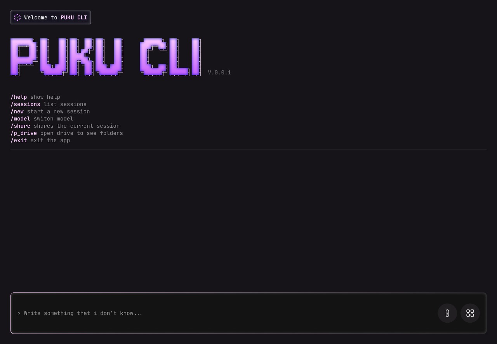

# PUKU CLI 🌟

A modern, aesthetic Terminal User Interface (TUI) CLI application for AI-powered conversations with multiple theme support and advanced features.



## Features

### **Multi-Theme Support**
- **PUKU Theme**: Purple gradient with dark background (#1a1b26)
- **Ocean Theme**: Blue oceanic colors with dark navy background  
- **Forest Theme**: Green nature-inspired palette with dark teal background
- **Live Theme Switching**: Change themes instantly with `/theme` command

### **Visual Design**
- **ASCII Art Title**: Large "PUKU CLI" with gradient effects
- **Rounded Borders**: Modern container styling with lipgloss
- **Responsive Layout**: Adapts to terminal window size
- **Color-Coded Messages**: Distinct styling for user/AI conversations
- **Status Indicators**: Real-time provider and streaming status

### **AI Integration**
- **Multiple Providers**: OpenRouter support with extensible architecture
- **Streaming Responses**: Real-time AI response rendering
- **Provider Switching**: Tab key to cycle between available providers
- **Environment Config**: Support for `.env` files and environment variables

### **Command System**
```
/help      - Show available commands
/sessions  - List conversation sessions
/new       - Start a new session
/model     - Switch AI model/provider
/share     - Share current session
/p_drive   - Browse files and folders
/theme     - Switch between themes
/exit      - Exit the application
```

## Installation

### Prerequisites
- **Go 1.20+** installed on your system
- **Terminal** with 256-color or true-color support

### Build from Source
```bash
# Clone the repository
git clone <repository-url>
cd Chat2

# Install dependencies
go mod tidy

# Build the application
go build -o puku.exe .
```

## Configuration

### Environment Setup
Create a `.env` file in the application directory:
```env
OPENROUTER_API_KEY=your_openrouter_api_key_here
```

Or set environment variables directly:
```bash
# Windows
set OPENROUTER_API_KEY=your_api_key

# Linux/macOS
export OPENROUTER_API_KEY=your_api_key
```

### API Keys
Currently supported providers:
- **OpenRouter**: Set `OPENROUTER_API_KEY` environment variable

## Usage

### Basic Usage
```bash
# Launch PUKU CLI
./puku.exe

# Start typing to chat with AI
> Hello, how are you today?

# Use commands with forward slash
> /help
> /theme
> /new
```

### Keyboard Shortcuts
- **Enter**: Send message or execute command
- **Tab**: Switch between AI providers
- **Ctrl+P**: Toggle provider information
- **Ctrl+C**: Exit application

### Theme Switching
```bash
# Cycle through available themes
> /theme

# Available themes:
# 1. PUKU (Purple) - Default theme with gradient effects
# 2. Ocean (Blue) - Oceanic blue palette
# 3. Forest (Green) - Nature-inspired green theme
```

## Architecture

### Project Structure
```
Chat2/
├── main.go                    # Application entry point
├── go.mod                     # Go module definition
├── internal/                  # Internal application packages
│   ├── app/                   # Application core & coordination
│   │   └── app.go            # Main application setup and lifecycle
│   ├── api/                   # AI provider integrations
│   │   └── providers.go      # API provider implementations
│   ├── chat/                  # Chat session & message management
│   │   └── session.go        # Session logic and message handling
│   ├── commands/              # Command system & handlers
│   │   └── commands.go       # Command registry (/help, /theme, etc.)
│   ├── config/                # Configuration management
│   │   └── config.go         # API key loading and configuration
│   ├── themes/                # Theme system
│   │   └── themes.go         # Theme definitions and management
│   ├── types/                 # Shared types & interfaces
│   │   └── messages.go       # Type definitions and global state
│   └── ui/                    # UI components & rendering
│       ├── ascii.go          # ASCII art generation
│       ├── styles.go         # UI styling definitions
│       ├── components/       # Reusable UI components
│       │   ├── input.go      # Text input component
│       │   └── sidebar.go    # Sidebar component
│       └── views/            # Main UI views
│           ├── main.go       # Main view implementation
│           ├── handlers.go   # Input/keyboard handling
│           ├── render.go     # Main rendering logic
│           └── render_helpers.go # Rendering helper functions
├── ARCHITECTURE.md           # Detailed architecture documentation
├── IMPLEMENTATION.md         # Implementation details
└── README.md                 # This file
```

### Key Components

#### Application Core (`internal/app/`)
- **Application Lifecycle**: Coordinates entire application startup and shutdown
- **Program Management**: Manages Bubble Tea program instance
- **Dependency Injection**: Initializes and connects all components

#### API Integration (`internal/api/`)
- **Provider Abstraction**: Unified interface for different AI services
- **Streaming Support**: Real-time response handling with Bubble Tea
- **Error Management**: Robust API error handling and recovery

#### Chat Management (`internal/chat/`)
- **Session State**: Manages conversation history and context
- **Message Handling**: Stores and retrieves user/AI messages
- **Provider Integration**: Connects sessions with AI providers

#### Command System (`internal/commands/`)
- **Command Registry**: Centralized command management
- **Slash Commands**: Implements all `/` commands (help, theme, new, etc.)
- **Command Validation**: Input parsing and command execution

#### Theme System (`internal/themes/`)
- **Dynamic Color Management**: Runtime theme switching
- **Extensible Design**: Easy to add new themes
- **Color Interpolation**: Gradient effects for ASCII art

#### UI Framework (`internal/ui/`)
- **Component Architecture**: Reusable UI components (input, sidebar)
- **View System**: Main application views with clean separation
- **Responsive Design**: Adapts to terminal dimensions
- **Bubble Tea Integration**: Modern TUI framework with proper state management

## Development

### Adding New Themes
```go
// In internal/themes/themes.go
"mytheme": {
    Name:            "My Theme",
    Background:      "#1a1a1a",
    Primary:         "#ff6b6b",
    Secondary:       "#ffa500",
    Accent:          "#4ecdc4",
    Text:            "#ffffff",
    DimText:         "#888888",
    Border:          "#ff6b6b",
    InputBackground: "#2a2a2a",
    Success:         "#4ecdc4",
    Warning:         "#ffa500",
    Error:           "#ff6b6b",
    Highlight:       "#ffa500",
},
```

### Adding New Commands
```go
// In internal/commands/commands.go
func (r *Registry) registerCommands() {
    r.commands["/mycommand"] = Command{
        Name:        "mycommand",
        Description: "My custom command description",
        Handler:     r.handleMyCommand,
    }
}

// Implement the command handler
func (r *Registry) handleMyCommand() tea.Cmd {
    r.model.AddMessage("Command executed!")
    return nil
}
```

### Adding New AI Providers
1. **Add provider configuration** in `internal/api/providers.go`
2. **Implement API integration** following the existing provider interface
3. **Add authentication** in `internal/config/config.go`
4. **Provider auto-discovery** - providers with valid API keys are automatically available
5. **Update provider switching** logic is handled automatically by the UI

## Screenshots

### PUKU Theme (Default)
*Purple gradient with dark background - the flagship theme*

> **Note**: Screenshot assets have been moved. The application features a beautiful purple gradient ASCII art title with the exact color palette specified in the design.

### Features Demo
- **Welcome Screen**: Branded welcome message
- **ASCII Title**: Large gradient "PUKU CLI" logo
- **Command Menu**: All available commands listed
- **Input Area**: Styled input field with icons
- **Live Streaming**: Real-time AI responses

## Contributing

### Contributing Guidelines
1. **Fork** the repository
2. **Create** a feature branch (`git checkout -b feature/amazing-feature`)
3. **Commit** your changes (`git commit -m 'Add amazing feature'`)
4. **Push** to the branch (`git push origin feature/amazing-feature`)
5. **Open** a Pull Request

## Support

- **Issues**: Report bugs via GitHub Issues
- **Documentation**: See `/docs` folder for detailed guides
- **Community**: Join our discussions in GitHub Discussions

---

**Made with ❤️ for terminal enthusiasts and AI power users**
