# 🐉 PukuCode


[](https://asciinema.org/a/tgZ0Xfvkh7TGXKdIxWzz8zEUJ)

## Key Features

- **Multi-Provider AI Support** → Anthropic, OpenAI, Google, Groq, Azure, Bedrock
- **Advanced Session Management** → 10 specialized modules for AI interaction
- **Git-Aware File Operations** → Real-time change tracking and project detection
- **Context-Driven Architecture** → AsyncLocalStorage patterns for state management
- **Tool Registry System** → 5 core AI tools (Bash, Edit, Grep, Read, Write)
- **Event-Driven Design** → Type-safe pub/sub system

## Architecture

```mermaid
flowchart TD
  %% ─────────────────────────── CLI & Commands ───────────────────────────
  subgraph CLI
    A[CLI Entry Point<br/>src/index.ts]
    B[Yargs Command Parser]
    A --> B

    B --> C[test command]
    B --> D[event-test command]
    B --> E[fs-test command]
    B --> F[app-info command]
    B --> G[config-test command]
    B --> H[auth-test command]
    B --> AUTH[auth command]
    B --> M[models command]
    B --> P[project-test command]
    B --> RUN[run command]
  end

  %% ─────────────────────────── App Context  ────────────────────────────
  subgraph AppContext["App Context (app/app.ts)"]
    I[App.provide]
    I --> I1[Git Detection<br/>findUp .git]
    I --> I2[Info Generation<br/>hostname, paths, time]
    I2 --> I3[Uses Global Paths<br/>global/index.ts]
    I --> I4[Context System<br/>util/context.ts]
    I4 --> I5[AsyncLocalStorage]
    I4 --> I6[Services Map]
    I6 --> I7[App.state<br/>lazy init + shutdown]
    I --> I8[App.initialize]
    I --> I9[App.shutdown]
  end

  %% ─────────────────────────── Global Paths ────────────────────────────
  subgraph Global["global/index.ts"]
    J1[XDG Path Resolve<br/>config/data/cache/state]
    J2[mkdir dirs if missing]
    J3[Cache Versioning]
  end
  I3 --> Global

  %% ─────────────────────────── Configuration System ────────────────────
  subgraph ConfigSystem["config/config.ts"]
    K1[Config.state<br/>Multi-source loader]
    K2[Schema Validation<br/>Zod schemas]
    K3[Agent/Mode/Command<br/>Markdown loading]
    K4[File References<br/>Environment vars]
    K5[Plugin Discovery<br/>TypeScript/JavaScript]
  end
  G --> ConfigSystem
  
  %% ─────────────────────────── Authentication System ────────────────────
  subgraph AuthSystem["auth/index.ts"]
    L1[Credential Management]
    L2[Provider Authentication]
    L3[Well-known Config<br/>Remote endpoints]
    L4[Token Storage<br/>Secure handling]
  end
  H --> AuthSystem
  AUTH --> AuthSystem
  
  %% ─────────────────────────── Services Layer ──────────────────────────
  subgraph Services
    S1[AppInfoService<br/>services/appInfoService.ts]
    S1 -->|defined with| I7
  end

  %% app-info command uses the service
  F --> S1
  %% service reads static Info
  S1 --> I2

  %% ─────────────────────────── Event Bus ───────────────────────────────
  subgraph EventBus["bus/index.ts"]
    EB1[Bus.event&lt;T&gt;<br/>Zod schema]
    EB2[Publish/Subscribe]
  end
  D --> EventBus
  EventBus --> EB1
  EventBus --> EB2
  %% callbacks run inside App Context
  EB2 --> I4

  %% ─────────────────────────── Filesystem Utils ────────────────────────
  subgraph FS["util/filesystem.ts"]
    FS1[contains]
    FS2[overlaps]
    FS3[findUp]
    FS4[up async iterator]
    FS5[globUp]
  end
  E --> FS

  %% ─────────────────────────── Project System ──────────────────────────
  subgraph ProjectSystem["Project System"]
    PS1[Project.fromDirectory<br/>project/project.ts]
    PS2[Instance.provide<br/>project/instance.ts]
    PS3[State Management<br/>project/state.ts]
    PS4[Storage Interface<br/>storage/storage.ts]
    PS1 --> PS4
    PS2 --> PS1
    PS3 --> PS4
  end
  
  %% ─────────────────────────── Provider System ─────────────────────────
  subgraph ProviderSystem["AI Provider System"]
    PV1[Provider.list<br/>provider/provider.ts]
    PV2[Model Discovery<br/>provider/models.ts]
    PV3[Multi-provider Support<br/>Anthropic/OpenAI/Groq/Google]
  end

  %% ─────────────────────────── Session System ─────────────────────────
  subgraph SessionSystem["Session System (Modular)"]
    SS1[Session Namespace<br/>session/index.ts]
    SS2[Types & Schemas<br/>session/types.ts]
    SS3[CRUD Operations<br/>session/crud.ts]
    SS4[Message Handling<br/>session/messages.ts]
    SS5[Prompt Processing<br/>session/processor.ts]
    SS6[Stream Processing<br/>session/stream-processor.ts]
    SS7[Shell Execution<br/>session/shell.ts]
    SS8[Command Execution<br/>session/command.ts]
    SS9[Operations<br/>session/operations.ts]
    SS10[Utilities<br/>session/utils.ts]

    SS1 --> SS2
    SS1 --> SS3
    SS1 --> SS4
    SS1 --> SS5
    SS1 --> SS6
    SS1 --> SS7
    SS1 --> SS8
    SS1 --> SS9
    SS1 --> SS10
    SS5 --> SS6
    SS5 --> ProviderSystem
  end

  %% ─────────────────────────── Command → Context Links ─────────────────
  %% test command
  C --> I
  %% event-test command
  D --> I
  %% fs-test command
  E --> I
  %% app-info command
  F --> I
  %% config-test command
  G --> I
  %% auth-test command
  H --> I
  %% models command (needs both contexts)
  M --> I
  M --> PS2
  PS2 --> ProviderSystem
  %% project-test command
  P --> I
  P --> PS1
  %% run command (AI interaction)
  RUN --> I
  RUN --> PS2
  RUN --> SessionSystem
```


## 🚀 Quick Start

### Installation

```bash
# Install globally (Recommended)
npm install -g .

# Or install dependencies for development
bun install
```

### Core Commands

#### Authentication & Models
```bash
# Authentication commands
pukucode auth login --provider anthropic --key sk-ant-xxx
pukucode auth login --provider openai --key sk-xxx
pukucode auth login --provider groq --key gsk-xxx
pukucode auth login --provider google --key your-google-key
pukucode auth logout --provider groq
pukucode auth list

# List available AI models
pukucode models
```

#### AI Interaction
```bash
# Start AI conversation
pukucode run "Hello, help me with my TypeScript project"

# Use specific model
pukucode run "Explain async/await" --model anthropic/claude-3-sonnet

# Continue session
pukucode run --session mysession --continue "Continue our discussion"

# Use different agent
pukucode run --agent build "Compile my project"
```

#### File Operations
```bash
# Check git file status
pukucode file-status

# Show project file tree
pukucode file-tree

# Read file with diff support
pukucode file-read src/index.ts
```

### Development Commands

#### System Testing
```bash
# Test core systems
bun src/index.ts test              # Application context test
bun src/index.ts event-test        # Event bus test
bun src/index.ts config-test       # Configuration system test
bun src/index.ts auth-test         # Authentication system test
bun src/index.ts project-test      # Project detection test

# File system testing
bun src/index.ts fs-test           # Filesystem utilities test
bun src/index.ts file-time-test src/index.ts  # File freshness test
bun src/index.ts watch-test        # File watcher test

# Provider testing
bun src/index.ts provider-test     # AI provider system test
bun src/index.ts bun-test --package chalk  # Bun module test

# Service testing
bun src/index.ts app-info          # App services test
```

#### Using npm Scripts
```bash
bun run test          # Application context test
bun run event-test    # Event bus test
bun run config-test   # Configuration test
bun run auth-test     # Authentication test
bun run models        # List AI models
```

## ❗ Troubleshooting

**Command not found:**
```bash
chmod +x src/index.ts
npm install -g .
pukucode --help
```

## 📁 Directory Structure

```
src/
├── index.ts              # CLI entry point with commands
│
├── app/
│   └── app.ts            # App context, lifecycle mgmt, and service registry
│
├── auth/
│   └── index.ts          # Authentication system with credential management
│
├── bus/
│   └── index.ts          # Event bus (pub/sub system)
│
├── cli/
│   ├── ui.ts            # UI utilities for terminal interactions
│   └── cmd/
│       ├── auth.ts      # Authentication commands (login/logout/list)
│       ├── models.ts    # Models command implementation
│       └── run.ts       # AI interaction run command implementation
│
├── config/
│   └── config.ts         # Configuration system with multi-source loading
│
├── global/
│   └── index.ts          # XDG paths, cache/version mgmt
│
├── project/
│   ├── project.ts        # Git repository detection and project metadata
│   ├── instance.ts       # Project context provider
│   └── state.ts          # State management for project-scoped data
│
├── provider/
│   ├── provider.ts       # AI model provider management
│   └── models.ts         # Model discovery and initialization
│
├── services/
│   └── appInfoService.ts # Example service (with init/shutdown)
│
├── session/             # Modular AI interaction system
│   ├── index.ts         # Main session namespace and re-exports
│   ├── types.ts         # Core types, schemas, and interfaces
│   ├── utils.ts         # Utility functions and constants
│   ├── crud.ts          # Session CRUD operations
│   ├── messages.ts      # Message and parts handling
│   ├── processor.ts     # Main prompt processing pipeline
│   ├── stream-processor.ts # Stream processing logic
│   ├── shell.ts         # Shell execution functionality
│   ├── command.ts       # Command execution logic
│   └── operations.ts    # Session operations (revert, summarize, etc.)
│
├── storage/
│   └── storage.ts        # Persistent data storage interface
│
└── util/
    ├── context.ts        # Context utility (AsyncLocalStorage wrapper)
    └── filesystem.ts     # Filesystem helpers (findUp, contains, overlaps, etc.)
```

## 🔄 High-level Architecture

### CLI (`index.ts`)
- Registers commands (`test`, `event-test`, `fs-test`, `app-info`, `config-test`, `auth-test`, `auth`, `models`, `project-test`, `run`)
- Wraps all commands inside an App context using `App.provide`
- Models command uses both App and Instance contexts for full functionality
- Auth command provides credential management with command-line interface
- Run command orchestrates AI interactions through the Session System

### App (`app/app.ts`)
- **Core:** Context + Info + Service Registry
- `App.provide` → sets up per-run context (hostname, Git root, config paths)
- `App.state` → define services (lazy initialized, optional shutdown)
- `App.initialize` / `App.shutdown` → lifecycle hooks

### Configuration System (`config/config.ts`)
- **Multi-source loading:** Global, project, and user configurations
- **Schema validation:** Comprehensive Zod-based validation
- **Markdown integration:** Agent, mode, and command definitions from `.md` files
- **Advanced features:** Environment variable substitution, file references
- **Plugin system:** Auto-discovery of TypeScript/JavaScript plugins

### Project System (`project/`)
- **Project detection:** Git repository discovery and metadata extraction
- **Instance context:** Project-specific context provider with directory and worktree info
- **State management:** Project-scoped data storage and lifecycle management
- **Storage integration:** Persistent storage for project information

### Provider System (`provider/`)
- **Multi-provider support:** Anthropic, OpenAI, Groq, and Google Gemini integrations
- **Model discovery:** Dynamic model enumeration and loading
- **Provider management:** Configuration and authentication handling

### Session System (`session/`) - Modular AI Interaction Engine
- **Modular architecture:** 10 specialized modules replacing 1,894-line monolith
- **Core processing:** `processor.ts` handles AI prompt processing and orchestration
- **Stream management:** `stream-processor.ts` manages real-time AI response streaming
- **CRUD operations:** `crud.ts` manages session lifecycle and persistence
- **Message handling:** `messages.ts` manages conversation messages and parts
- **Shell integration:** `shell.ts` enables terminal command execution within AI sessions
- **Command processing:** `command.ts` handles custom command templates and execution
- **Session operations:** `operations.ts` provides revert, summarize, and initialization functions
- **Type safety:** `types.ts` centralizes all session-related types and schemas
- **Utilities:** `utils.ts` provides shared helpers, constants, and state management
- **Unified interface:** `index.ts` maintains backward compatibility while exposing modular functionality

### Storage System (`storage/`)
- **Key-value storage:** Hierarchical key-based data persistence
- **CRUD operations:** Create, read, update, and delete with type safety
- **Project integration:** Used by project system for metadata storage

### Authentication System (`auth/index.ts`)
- **Credential management:** Secure storage and retrieval of API keys
- **Provider integration:** Support for multiple AI providers
- **Well-known endpoints:** Remote configuration loading
- **Token handling:** Environment variable injection and management

### Event Bus (`bus/index.ts`)
- Simple pub/sub messaging
- Events validated with Zod
- Used in `event-test` demo

### Filesystem Utils (`util/filesystem.ts`)
- `contains(parent, child)`
- `overlaps(a, b)`
- `findUp(target, start [, stop])`
- `up({ targets, start, stop })` (async generator)
- `globUp(pattern, start [, stop])`

### Global Paths (`global/index.ts`)
- Respects XDG Base Directories (`~/.config`, `~/.cache`, etc.)
- Auto-creates folder structure
- Handles cache versioning

## 📖 Example Usage

### Authentication Setup
```bash
# List stored credentials
pukucode auth list

# Example output:
# ┌  Credentials ~/.config/pukucode/auth.json
# │  Anthropic (api)
# │  Groq (api)
# └  2 credentials
```

### AI Interaction Examples
```bash
# Basic conversation
pukucode run "Explain TypeScript interfaces"

# With specific model
pukucode run "Review this code" --model anthropic/claude-3-sonnet

# Continue previous session
pukucode run --session project-help --continue "What about error handling?"
```

### File Operations Examples
```bash
# Check git status
pukucode file-status
# Shows: 5 files changed (+120 -45 lines)

# View project structure
pukucode file-tree -l 10
# Shows: Directory tree with 10 items

# Read with diff
pukucode file-read src/app.ts
# Shows: File content with git diff if modified
```

## 🧠 Key Concepts

- **Application Lifecycle:** Context created → work performed → services cleaned up
- **Context System:** AsyncLocalStorage-based state sharing across commands
- **Session Management:** Persistent AI conversations with revert/undo capabilities
- **Multi-Provider AI:** Unified interface for different AI providers
- **Git Integration:** Project-aware file operations with change tracking
- **Modular Architecture:** Clean separation of concerns across 25 specialized modules

## 🤖 AI Provider Support

**Supported Providers:**
- **Anthropic** - Claude models (claude-3-sonnet, claude-3-haiku, etc.)
- **OpenAI** - GPT models (gpt-4, gpt-3.5-turbo, etc.)
- **Google** - Gemini models (gemini-1.5-pro, gemini-1.5-flash)
- **Groq** - Fast inference models (llama-3.1-70b-versatile, etc.)
- **Azure OpenAI** - Enterprise OpenAI models
- **AWS Bedrock** - Amazon's managed AI models

**Usage Examples:**
```bash
# Use different providers
pukucode run "hello" --model anthropic/claude-3-sonnet
pukucode run "hello" --model openai/gpt-4
pukucode run "hello" --model google/gemini-1.5-flash
pukucode run "hello" --model groq/llama-3.1-70b-versatile
```

## 🌐 Server API

PukuCode includes a built-in REST API server that exposes all core functionality via HTTP endpoints. This enables integration with web interfaces, TUI applications, and external tools.

### Starting the Server

```bash
# Start server on default port 3000
pukucode server

# Start on custom port and hostname
pukucode server --port 8080 --hostname 0.0.0.0

# Start and auto-open browser
pukucode server --open

# Command options
pukucode server --help
```

### API Documentation

The server provides comprehensive API documentation accessible at:
- **Documentation URL:** `http://localhost:3000/doc`
- **Interactive docs** with copy-to-clipboard examples
- **25+ endpoints** organized by category

### API Equivalent of CLI Commands

**CLI Command:** `pukucode run "hello" --model google/gemini-1.5-flash`

**API Equivalent:**
```bash
# Step 1: Create session
SESSION_ID=$(curl -s -X POST http://localhost:3000/session \
  -H "Content-Type: application/json" \
  -d '{"title":"CLI Run Session"}' | jq -r '.id')

# Step 2: Send prompt
curl -X POST http://localhost:3000/session/$SESSION_ID/message \
  -H "Content-Type: application/json" \
  -d '{
    "model": {
      "providerID": "google",
      "modelID": "gemini-1.5-flash"
    },
    "parts": [
      {
        "type": "text",
        "text": "hello"
      }
    ]
  }'
```

### Core API Categories

#### 🗂️ Session Management
```bash
# List all sessions
curl -X GET http://localhost:3000/session

# Create new session
curl -X POST http://localhost:3000/session \
  -H "Content-Type: application/json" \
  -d '{"title": "My Project Session"}'

# Get session details
curl -X GET http://localhost:3000/session/{session_id}

# Get session children
curl -X GET http://localhost:3000/session/{session_id}/children

# Update session
curl -X PATCH http://localhost:3000/session/{session_id} \
  -H "Content-Type: application/json" \
  -d '{"title": "Updated Session Title"}'

# Delete session
curl -X DELETE http://localhost:3000/session/{session_id}

# Initialize session
curl -X POST http://localhost:3000/session/{session_id}/init \
  -H "Content-Type: application/json" \
  -d '{
    "messageID": "msg_123",
    "providerID": "anthropic",
    "modelID": "claude-3-sonnet"
  }'

# Abort session
curl -X POST http://localhost:3000/session/{session_id}/abort

# Revert session messages
curl -X POST http://localhost:3000/session/{session_id}/revert \
  -H "Content-Type: application/json" \
  -d '{"messageID": "msg_123"}'

# Unrevert session
curl -X POST http://localhost:3000/session/{session_id}/unrevert
```

#### 💬 AI Messaging
```bash
# Send message to AI (with model selection)
curl -X POST http://localhost:3000/session/{session_id}/message \
  -H "Content-Type: application/json" \
  -d '{
    "model": {
      "providerID": "anthropic",
      "modelID": "claude-3-sonnet"
    },
    "parts": [
      {
        "type": "text",
        "text": "Hello, help me with TypeScript"
      }
    ],
    "agent": "build",
    "system": "You are a TypeScript expert"
  }'

# Send message with tools enabled
curl -X POST http://localhost:3000/session/{session_id}/message \
  -H "Content-Type: application/json" \
  -d '{
    "parts": [{"type": "text", "text": "Read the README file"}],
    "tools": {"read": true, "bash": true}
  }'

# Get conversation messages
curl -X GET http://localhost:3000/session/{session_id}/message

# Get specific message
curl -X GET http://localhost:3000/session/{session_id}/message/{message_id}
```

#### 🛠️ Command Execution
```bash
# Execute shell command
curl -X POST http://localhost:3000/session/{session_id}/shell \
  -H "Content-Type: application/json" \
  -d '{
    "command": "ls -la",
    "cwd": "/path/to/directory"
  }'

# Run predefined command
curl -X POST http://localhost:3000/session/{session_id}/command \
  -H "Content-Type: application/json" \
  -d '{
    "command": "code_review",
    "arguments": {"file": "src/main.ts"}
  }'

# Permission response
curl -X POST http://localhost:3000/session/{session_id}/permissions/{permission_id} \
  -H "Content-Type: application/json" \
  -d '{"response": "allow"}'
```

#### 📁 File Operations
```bash
# List files and directories
curl -X GET "http://localhost:3000/file?path=src"

# Read file content (with git diff if modified)
curl -X GET "http://localhost:3000/file/content?path=src/index.ts"

# Get file status (git changes)
curl -X GET http://localhost:3000/file/status
```

#### 🤖 Provider & Model Management
```bash
# Get current configuration
curl -X GET http://localhost:3000/config

# Get current paths
curl -X GET http://localhost:3000/path

# List available AI providers and models
curl -X GET http://localhost:3000/config/providers

# List all available commands
curl -X GET http://localhost:3000/command

# List all agents
curl -X GET http://localhost:3000/agent
```

#### 🔧 Tool Management
```bash
# List all tool IDs
curl -X GET http://localhost:3000/experimental/tool/ids

# Get tools for specific provider/model
curl -X GET "http://localhost:3000/experimental/tool?provider=anthropic&model=claude-3-sonnet"

# Example response:
# [
#   {
#     "id": "bash",
#     "description": "Execute bash commands",
#     "parameters": {
#       "type": "object",
#       "properties": {
#         "command": {"type": "string"}
#       }
#     }
#   },
#   {
#     "id": "read",
#     "description": "Read file contents",
#     "parameters": {
#       "type": "object",
#       "properties": {
#         "path": {"type": "string"}
#       }
#     }
#   }
# ]
```

#### 🔄 Real-time Events
```bash
# Subscribe to real-time events via Server-Sent Events
curl -X GET http://localhost:3000/event \
  -H "Accept: text/event-stream"

# Example events received:
# data: {"type":"server.connected","properties":{}}
# data: {"type":"session.created","properties":{"sessionID":"ses_123"}}
# data: {"type":"message.started","properties":{"messageID":"msg_456"}}
# data: {"type":"file.edited","properties":{"file":"src/index.ts"}}
```

#### 📋 Logging
```bash
# Write log entry to server logs
curl -X POST http://localhost:3000/log \
  -H "Content-Type: application/json" \
  -d '{
    "service": "my-app",
    "level": "info",
    "message": "User action completed",
    "extra": {
      "userId": "123",
      "action": "file_read"
    }
  }'
```

#### 🖥️ TUI Integration
```bash
# Append prompt to TUI
curl -X POST http://localhost:3000/tui/append-prompt \
  -H "Content-Type: application/json" \
  -d '{"text": "Hello from API"}'

# Show toast notification
curl -X POST http://localhost:3000/tui/show-toast \
  -H "Content-Type: application/json" \
  -d '{
    "title": "Success",
    "message": "Operation completed",
    "variant": "success"
  }'

# Open various dialogs
curl -X POST http://localhost:3000/tui/open-help
curl -X POST http://localhost:3000/tui/open-sessions
curl -X POST http://localhost:3000/tui/open-themes
curl -X POST http://localhost:3000/tui/open-models

# Execute TUI commands
curl -X POST http://localhost:3000/tui/execute-command \
  -H "Content-Type: application/json" \
  -d '{"command": "agent_cycle"}'

# Prompt actions
curl -X POST http://localhost:3000/tui/submit-prompt
curl -X POST http://localhost:3000/tui/clear-prompt
```

#### 🔐 Authentication
```bash
# Set provider credentials
curl -X PUT http://localhost:3000/auth/{provider_id} \
  -H "Content-Type: application/json" \
  -d '{
    "key": "your-api-key",
    "endpoint": "https://api.example.com"
  }'

# Examples for different providers:
# Anthropic
curl -X PUT http://localhost:3000/auth/anthropic \
  -H "Content-Type: application/json" \
  -d '{"key": "sk-ant-api03-xxx"}'

# OpenAI
curl -X PUT http://localhost:3000/auth/openai \
  -H "Content-Type: application/json" \
  -d '{"key": "sk-xxx"}'

# Google
curl -X PUT http://localhost:3000/auth/google \
  -H "Content-Type: application/json" \
  -d '{"key": "your-google-api-key"}'
```

### Complete API Workflow Examples

#### Example 1: AI Code Review Workflow
```bash
# 1. Create session for code review
SESSION_ID=$(curl -s -X POST http://localhost:3000/session \
  -H "Content-Type: application/json" \
  -d '{"title":"Code Review Session"}' | jq -r '.id')

# 2. Get file status to see what changed
curl -X GET http://localhost:3000/file/status

# 3. Read specific file
curl -X GET "http://localhost:3000/file/content?path=src/server.ts"

# 4. Send to AI for review
curl -X POST http://localhost:3000/session/$SESSION_ID/message \
  -H "Content-Type: application/json" \
  -d '{
    "model": {"providerID": "anthropic", "modelID": "claude-3-sonnet"},
    "parts": [{"type": "text", "text": "Please review the server.ts file for potential issues"}],
    "tools": {"read": true, "bash": true}
  }'

# 5. Get the AI response
curl -X GET http://localhost:3000/session/$SESSION_ID/message
```

#### Example 2: Real-time Development Assistant
```bash
# 1. Subscribe to file events
curl -X GET http://localhost:3000/event -H "Accept: text/event-stream" &

# 2. Create persistent session
SESSION_ID=$(curl -s -X POST http://localhost:3000/session \
  -d '{"title":"Development Assistant"}' | jq -r '.id')

# 3. Monitor and respond to changes (simulated)
curl -X POST http://localhost:3000/session/$SESSION_ID/message \
  -H "Content-Type: application/json" \
  -d '{
    "parts": [{"type": "text", "text": "Monitor my project for errors and suggest fixes"}],
    "tools": {"bash": true, "read": true}
  }'
```

#### Example 3: Automated Testing Integration
```bash
# 1. Create testing session
SESSION_ID=$(curl -s -X POST http://localhost:3000/session \
  -d '{"title":"Automated Testing"}' | jq -r '.id')

# 2. Run tests via shell command
curl -X POST http://localhost:3000/session/$SESSION_ID/shell \
  -H "Content-Type: application/json" \
  -d '{"command": "npm test"}'

# 3. If tests fail, ask AI to analyze
curl -X POST http://localhost:3000/session/$SESSION_ID/message \
  -H "Content-Type: application/json" \
  -d '{
    "parts": [{"type": "text", "text": "The tests failed. Please analyze the errors and suggest fixes."}],
    "tools": {"bash": true, "read": true}
  }'
```

### Server Features

- **Full API Coverage** - All CLI functionality exposed via REST endpoints
- **Real-time Updates** - Server-Sent Events for live session updates
- **CORS Enabled** - Cross-origin requests supported for web integrations
- **Error Handling** - Comprehensive error responses with detailed messages
- **Request Logging** - Built-in request/response logging for debugging
- **Tool Integration** - Execute bash, file operations, and AI tools via API
- **Session State** - Persistent session management across API calls

### Integration Examples

**TUI Integration:**
```bash
# The server enables external TUI applications to:
# - Send prompts and receive AI responses
# - Execute commands and tools
# - Manage session state
# - Display real-time notifications
```

**Web Integration:**
```bash
# Build web interfaces that can:
# - Browse and manage AI sessions
# - Send messages and view responses
# - Execute shell commands remotely
# - Monitor file changes and git status
```

**External Tools:**
```bash
# Integrate with external tools via HTTP:
# - CI/CD pipelines triggering AI analysis
# - Code editors sending context to AI
# - Monitoring systems using AI for diagnostics
```

The server transforms PukuCode from a CLI-only tool into a complete AI development platform accessible from any HTTP client.