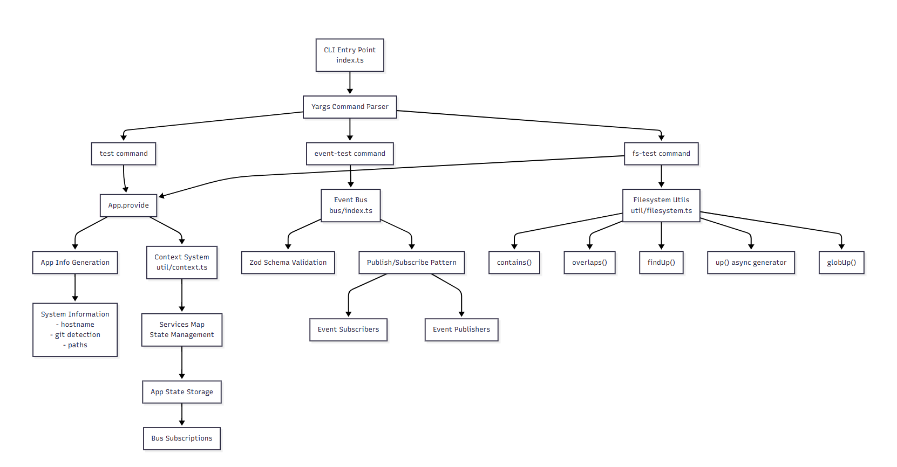

# 🐉 PukuCode - Terminal AI Assistant

A **TypeScript-based terminal AI assistant** with a **modular architecture** built on [Bun](https://bun.sh/) runtime.  
It uses **Application Contexts**, an **Event Bus system**, and **Filesystem utilities** to organize features in a scalable way.

---

## 🚀 Quick Start

### Run tests
```bash
# Run application context test
bun src/index.ts test

# Run event bus test
bun src/index.ts event-test

# Run filesystem test
bun src/index.ts fs-test
```

## 📁 Directory Structure

```
src/
├── index.ts            # CLI entry point with commands (test, event-test, fs-test)
│
├── app/
│   └── app.ts          # Application context and state management
│
├── bus/
│   └── index.ts        # Event bus system
│
└── util/
    ├── context.ts      # Context provider utility
    └── filesystem.ts   # Filesystem helpers (findUp, globUp, contains, overlaps, etc.)
```

## 🏗️ System Architecture



### High-level Flow

#### CLI (index.ts)
- Registers commands using Yargs (test, event-test, fs-test)
- Provides entrypoints into different subsystems

#### App Context (app/app.ts)
- Provides global application state (hostname, paths, services)
- Manages dependency injection using a Context utility

#### Event Bus (bus/index.ts)
- Implements event publication and subscription
- Useful for decoupled communication across modules

#### Filesystem Utils (util/filesystem.ts)
- Provides helpful filesystem operations:
  - `contains(parent, child)`
  - `overlaps(a, b)`
  - `findUp(target, start [, stop])`
  - `up({ targets, start, stop })` (async generator)
  - `globUp(pattern, start [, stop])`

## 📖 Example Usage

### Application Context
```bash
bun src/index.ts test
```

Logs initialization details:

```
App initialized: {
  hostname: "my-machine",
  git: false,
  path: { config, data, root, cwd }
}
```

### Event Bus
```bash
bun src/index.ts event-test
```

Publishes an event and logs subscription result:

```
Received: Hello Events!
```

### Filesystem Utilities
```bash
bun src/index.ts fs-test
```

Runs a demo of filesystem helpers:

- ✅ Checks if working dir is inside $HOME
- ✅ Finds nearest package.json
- ✅ Checks path overlaps
- ✅ Walks up searching for .gitignore

Example output:

```
Is cwd inside home? true
Found package.json files: [ '/project/package.json' ]
Does cwd overlap with cwd/subdir? true
Found .gitignore walking up: /project/.gitignore
```

---

*Built with TypeScript, Bun, Yargs, and Zod*