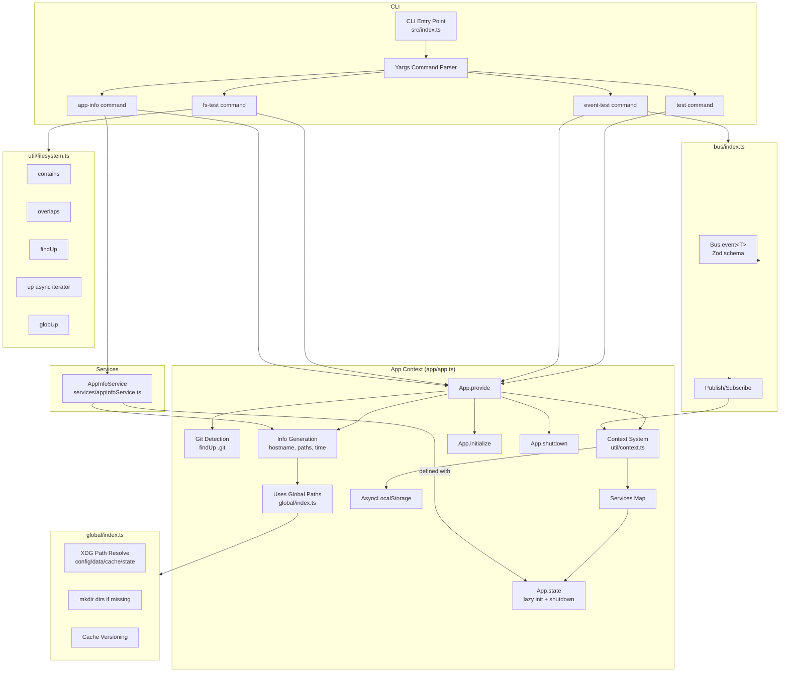

# 🐉 PukuCode - Terminal AI Assistant

A TypeScript-based terminal AI assistant built on the Bun runtime.

It uses a clean and modular architecture featuring:

- **Application Contexts** → Provides global app info & service lifecycle
- **Event Bus** → Decoupled publish–subscribe messaging
- **Filesystem Utilities** → Powerful helpers for working with the system paths
- **Services** → Lazy-loaded, reusable runtime dependencies with lifecycle hooks

## Architecture


## 🚀 Quick Start

### Option 1: Global Installation (Recommended)

```bash
# Install globally
npm install -g .

# Run directly
pukucode test
pukucode event-test
pukucode fs-test
pukucode app-info
```

### Option 2: Direct Execution with Bun

```bash
# Run application context test
bun src/index.ts test

# Run event bus test
bun src/index.ts event-test

# Run filesystem test
bun src/index.ts fs-test

# Run app services test
bun src/index.ts app-info
```

### Option 3: Using npm Scripts

```bash
bun run test
bun run event-test
bun run fs-test
bun run app-info
```

## ❗ Troubleshooting `pukucode: command not found`

**Make file executable:**

```bash
chmod +x src/index.ts
```

**Install globally:**

```bash
npm install -g .
```

**Verify installation:**

```bash
pukucode --help
```

## 📁 Directory Structure

```
src/
├── index.ts              # CLI entry point with commands
│
├── app/
│   └── app.ts            # App context, lifecycle mgmt, and service registry
│
├── bus/
│   └── index.ts          # Event bus (pub/sub system)
│
├── global/
│   └── index.ts          # XDG paths, cache/version mgmt
│
├── services/
│   └── appInfoService.ts # Example service (with init/shutdown)
│
└── util/
    ├── context.ts        # Context utility (AsyncLocalStorage wrapper)
    └── filesystem.ts     # Filesystem helpers (findUp, contains, overlaps, etc.)
```

## 🔄 High-level Architecture

### CLI (`index.ts`)
- Registers commands (`test`, `event-test`, `fs-test`, `app-info`)
- Wraps all commands inside an App context using `App.provide`

### App (`app/app.ts`)
- **Core:** Context + Info + Service Registry
- `App.provide` → sets up per-run context (hostname, Git root, config paths)
- `App.state` → define services (lazy initialized, optional shutdown)
- `App.initialize` / `App.shutdown` → lifecycle hooks

### Event Bus (`bus/index.ts`)
- Simple pub/sub messaging
- Events validated with Zod
- Used in `event-test` demo

### Filesystem Utils (`util/filesystem.ts`)
- `contains(parent, child)`
- `overlaps(a, b)`
- `findUp(target, start [, stop])`
- `up({ targets, start, stop })` (async generator)
- `globUp(pattern, start [, stop])`

### Global Paths (`global/index.ts`)
- Respects XDG Base Directories (`~/.config`, `~/.cache`, etc.)
- Auto-creates folder structure
- Handles cache versioning

## 📖 Example Usage

### 🔹 Application Context

```bash
bun src/index.ts test
```

**Example Output:**

```
App initialized: {
  hostname: "my-machine",
  git: false,
  path: { config, data, root, cwd, state },
  time: { initialized: 1700000000 }
}
```

### 🔹 Event Bus

```bash
bun src/index.ts event-test
```

**Example Output:**

```
Received: Hello Events!
```

### 🔹 Filesystem Utilities

```bash
bun src/index.ts fs-test
```

**Example Output:**

```
Is cwd inside home? true
Found package.json files: [ '/project/package.json' ]
Does cwd overlap with cwd/subdir? true
Found .gitignore walking up: /project/.gitignore
```

### 🔹 Services + Lifecycle

Test the App Info Service (with init + shutdown hooks):

```bash
bun src/index.ts app-info
```

**Example Output:**

```
=== From App.info() ===
Hostname: my-laptop
Root directory: /home/user/my-project
Git repo?: true

=== From App.state (App Info Service) ===
🚀 Initializing AppInfoService
{
  hostname: 'my-laptop',
  cwd: '/home/user/my-project',
  root: '/home/user/my-project',
  configDir: '/home/user/.config/pukucode',
  gitRepo: true
}
🛑 Shutting down AppInfoService
```

## 🧠 Key Concepts

- **Application Lifecycle:** Each run = context created → work → services cleaned up.
- **Info:** Static metadata (hostname, paths, git detection).
- **Services:** Live, reusable singletons that are initialized once and optionally have shutdown hooks.
- **Context:** AsyncLocalStorage-based "backpack" for sharing state across commands without passing manually.


## Testing for understanding:
### File.status()
```bash
bun src/index.ts file-status
```
###File.read()
```bash
bun src/index.ts file-read src/README.md
```

### ripgrep Show all
```bash
bun src/index.ts file-tree
```

### ripgrep Limit to 5
```bash
bun src/index.ts file-tree -l 5
```