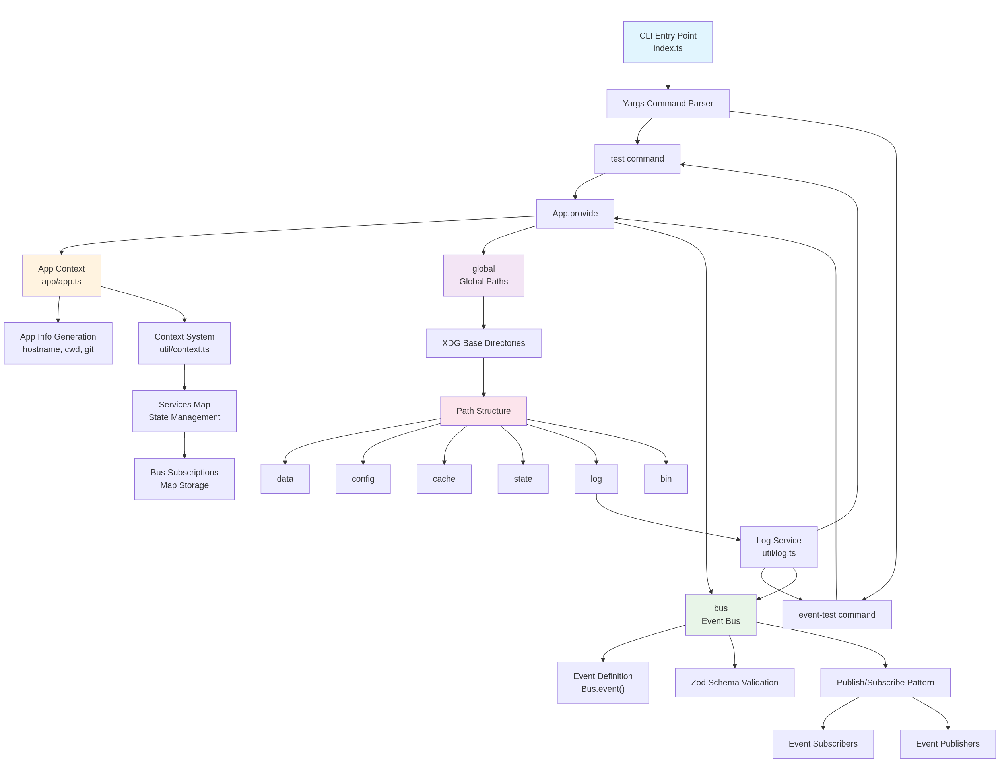

# PukuCode - Source Architecture

A TypeScript-based terminal AI assistant with modular architecture built on Bun runtime.

## 🚀 Quick Start

### Option 1: Using Global Command (Recommended)

```bash
# Install globally first
npm install -g .

# Then use the pukucode command directly
pukucode test
pukucode event-test
```

### Option 2: Direct Execution

```bash
# Run application context test
bun src/index.ts test

# Run event bus test
bun src/index.ts event-test
```

### Option 3: Using npm scripts

```bash
# Run tests using package.json scripts
bun run test
bun run event-test
```

### Troubleshooting `pukucode: command not found`

If the `pukucode` command is not found:

1. **Make the file executable:**
   ```bash
   chmod +x src/index.ts
   ```

2. **Install globally:**
   ```bash
   npm install -g .
   ```

3. **Verify installation:**
   ```bash
   pukucode --help
   ```

## 📁 Directory Structure

```
src/
├── index.ts           # CLI entry point with commands
├── app/
│   └── app.ts        # Application context and state management
├── bus/
│   └── index.ts      # Event bus system (@bus/ import)
├── global/
│   └── index.ts      # Global paths and configuration (@global/ import)
└── util/
    └── context.ts    # Context provider utility
```

## 🏗️ System Architecture Flow


## Uptaded architecture 



---

*Built with TypeScript, Bun, Yargs, and Zod*