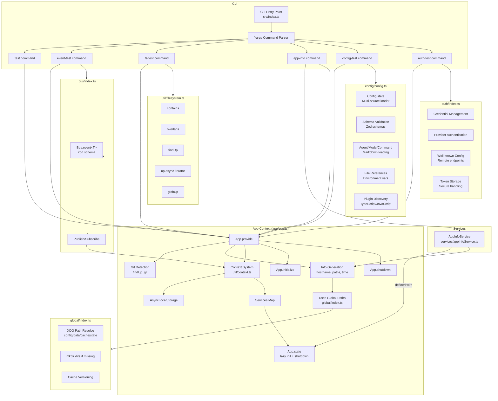

# 🐉 PukuCode - Terminal AI Assistant

A TypeScript-based terminal AI assistant built on the Bun runtime.

It uses a clean and modular architecture featuring:

- **Application Contexts** → Provides global app info & service lifecycle
- **Configuration System** → Multi-source config loading with validation and schema support
- **Authentication** → Secure credential management for AI providers and services
- **Event Bus** → Decoupled publish–subscribe messaging
- **Filesystem Utilities** → Powerful helpers for working with the system paths
- **Services** → Lazy-loaded, reusable runtime dependencies with lifecycle hooks

## Architecture


## 🚀 Quick Start

### Option 1: Global Installation (Recommended)

```bash
# Install globally
npm install -g .

# Run directly
pukucode test
pukucode event-test
pukucode fs-test
pukucode app-info
pukucode config-test
pukucode auth-test
```

### Option 2: Direct Execution with Bun

```bash
# Run application context test
bun src/index.ts test

# Run event bus test
bun src/index.ts event-test

# Run filesystem test
bun src/index.ts fs-test

# Run app services test
bun src/index.ts app-info

# Run configuration system test
bun src/index.ts config-test

# Run authentication system test
bun src/index.ts auth-test
```

### Option 3: Using npm Scripts

```bash
bun run test
bun run event-test
bun run fs-test
bun run app-info
bun run config-test
bun run auth-test
```

## ❗ Troubleshooting `pukucode: command not found`

**Make file executable:**

```bash
chmod +x src/index.ts
```

**Install globally:**

```bash
npm install -g .
```

**Verify installation:**

```bash
pukucode --help
```

## 📁 Directory Structure

```
src/
├── index.ts              # CLI entry point with commands
│
├── app/
│   └── app.ts            # App context, lifecycle mgmt, and service registry
│
├── auth/
│   └── index.ts          # Authentication system with credential management
│
├── bus/
│   └── index.ts          # Event bus (pub/sub system)
│
├── config/
│   └── config.ts         # Configuration system with multi-source loading
│
├── global/
│   └── index.ts          # XDG paths, cache/version mgmt
│
├── services/
│   └── appInfoService.ts # Example service (with init/shutdown)
│
└── util/
    ├── context.ts        # Context utility (AsyncLocalStorage wrapper)
    └── filesystem.ts     # Filesystem helpers (findUp, contains, overlaps, etc.)
```

## 🔄 High-level Architecture

### CLI (`index.ts`)
- Registers commands (`test`, `event-test`, `fs-test`, `app-info`, `config-test`, `auth-test`)
- Wraps all commands inside an App context using `App.provide`

### App (`app/app.ts`)
- **Core:** Context + Info + Service Registry
- `App.provide` → sets up per-run context (hostname, Git root, config paths)
- `App.state` → define services (lazy initialized, optional shutdown)
- `App.initialize` / `App.shutdown` → lifecycle hooks

### Configuration System (`config/config.ts`)
- **Multi-source loading:** Global, project, and user configurations
- **Schema validation:** Comprehensive Zod-based validation
- **Markdown integration:** Agent, mode, and command definitions from `.md` files
- **Advanced features:** Environment variable substitution, file references
- **Plugin system:** Auto-discovery of TypeScript/JavaScript plugins

### Authentication System (`auth/index.ts`)
- **Credential management:** Secure storage and retrieval of API keys
- **Provider integration:** Support for multiple AI providers
- **Well-known endpoints:** Remote configuration loading
- **Token handling:** Environment variable injection and management

### Event Bus (`bus/index.ts`)
- Simple pub/sub messaging
- Events validated with Zod
- Used in `event-test` demo

### Filesystem Utils (`util/filesystem.ts`)
- `contains(parent, child)`
- `overlaps(a, b)`
- `findUp(target, start [, stop])`
- `up({ targets, start, stop })` (async generator)
- `globUp(pattern, start [, stop])`

### Global Paths (`global/index.ts`)
- Respects XDG Base Directories (`~/.config`, `~/.cache`, etc.)
- Auto-creates folder structure
- Handles cache versioning

## 📖 Example Usage

### 🔹 Application Context

```bash
bun src/index.ts test
```

**Example Output:**

```
App initialized: {
  hostname: "my-machine",
  git: false,
  path: { config, data, root, cwd, state },
  time: { initialized: 1700000000 }
}
```

### 🔹 Event Bus

```bash
bun src/index.ts event-test
```

**Example Output:**

```
Received: Hello Events!
```

### 🔹 Filesystem Utilities

```bash
bun src/index.ts fs-test
```

**Example Output:**

```
Is cwd inside home? true
Found package.json files: [ '/project/package.json' ]
Does cwd overlap with cwd/subdir? true
Found .gitignore walking up: /project/.gitignore
```

### 🔹 Services + Lifecycle

Test the App Info Service (with init + shutdown hooks):

```bash
bun src/index.ts app-info
```

**Example Output:**

```
=== From App.info() ===
Hostname: my-laptop
Root directory: /home/user/my-project
Git repo?: true

=== From App.state (App Info Service) ===
🚀 Initializing AppInfoService
{
  hostname: 'my-laptop',
  cwd: '/home/user/my-project',
  root: '/home/user/my-project',
  configDir: '/home/user/.config/pukucode',
  gitRepo: true
}
🛑 Shutting down AppInfoService
```

### 🔹 Configuration System

```bash
bun src/index.ts config-test
```

**Example Output:**

```
=== Configuration System Test ===
✅ Global config loaded from: /home/user/.config/pukucode
✅ Project configs found: pukucode.jsonc, pukucode.json
✅ Agent definitions loaded: 3 agents from markdown files
✅ Command templates loaded: 5 custom commands
✅ Plugin discovery: 2 TypeScript plugins found
✅ Schema validation: All configurations valid

Final merged configuration:
{
  "theme": "dark",
  "model": "anthropic/claude-3-sonnet",
  "agents": { "plan": {...}, "build": {...} },
  "keybinds": { "leader": "ctrl+x" },
  ...
}
```

### 🔹 Authentication System

```bash
bun src/index.ts auth-test
```

**Example Output:**

```
=== Authentication System Test ===
✅ Credential storage initialized
✅ Provider authentication configured
✅ Well-known endpoints discovered: 2 remote configs
✅ Environment variables injected: ANTHROPIC_API_KEY, OPENAI_API_KEY
✅ Token validation successful

Authentication providers:
- anthropic: ✅ Valid API key
- openai: ✅ Valid API key  
- custom-provider: ⚠️  Well-known config loaded
```

## 🧠 Key Concepts

- **Application Lifecycle:** Each run = context created → work → services cleaned up.
- **Info:** Static metadata (hostname, paths, git detection).
- **Services:** Live, reusable singletons that are initialized once and optionally have shutdown hooks.
- **Context:** AsyncLocalStorage-based "backpack" for sharing state across commands without passing manually.
- **Configuration:** Multi-layered system supporting global, project, and user configurations with validation.
- **Authentication:** Secure credential management with support for multiple AI providers and remote configs.
- **Modularity:** Clean separation between core systems, services, and utilities for maintainability.


# Testing for understanding:
### File.status()
```bash
bun src/index.ts file-status
```
###File.read()
```bash
bun src/index.ts file-read src/README.md
```

### ripgrep Show all
```bash
bun src/index.ts file-tree
```

### ripgrep Limit to 5
```bash
bun src/index.ts file-tree -l 5
```

## time.ts testing

🧪Testing Instructions
Now, you can properly test the intended behavior:

### Scenario 1: Don't modify the file

Run the command:
```bash
bun src/index.ts file-time-test src/index.ts
```
Do nothing for 10 seconds.

Expected Output:
```text
[1] Reading file 'src/index.ts' and recording timestamp...
   -> Timestamp recorded: 2023-10-27T10:30:00.123Z
   -> ✔ Immediately after reading, the file is fresh. Correct.

[2] You now have 10 seconds to manually edit and save the file: src/index.ts

[3] Checking file freshness again after 10 seconds...
   -> ✔ OK: The file was NOT modified in the last 10 seconds.
```

### Scenario 2: Modify the file
Run the command:
```bash
bun src/index.ts file-time-test src/index.ts
```
You will see the message: [2] You now have 10 seconds...
Quickly open src/index.ts in your editor, add a space or a comment, and save it.
Wait for the 10 seconds to finish.

Expected Output:
```text
[1] Reading file 'src/index.ts' and recording timestamp...
   -> Timestamp recorded: 2023-10-27T10:35:00.456Z
   -> ✔ Immediately after reading, the file is fresh. Correct.

[2] You now have 10 seconds to manually edit and save the file: src/index.ts

[3] Checking file freshness again after 10 seconds...
   -> ❌ FAILED: The file was modified since it was last read. Correct!
      Reason: File src/index.ts has been modified since it was last read.
      Last modification: 2023-10-27T10:35:05.789Z
      Last read: 2023-10-27T10:35:00.456Z

      Please read the file again before modifying it.
```


## watcher testing
```bash
bun src/index.ts watch-test
```

Open another terminal on pukucode directory, and then do this:
```bash
echo "// test" >> src/test.ts
```